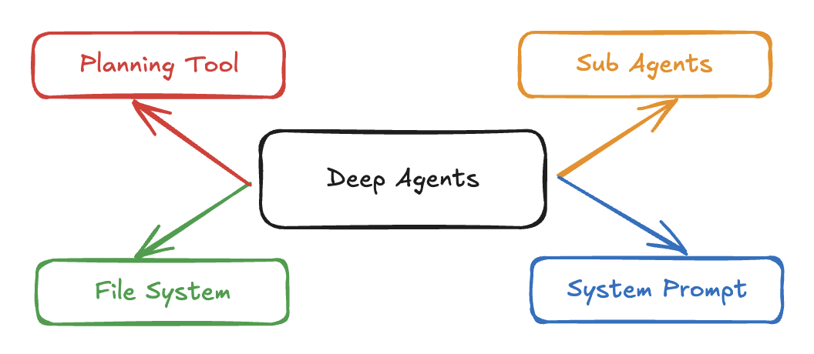

# 🧠🤖 Deep Research Agent

A sophisticated AI research platform that combines a powerful "Deep Agent" backend with an intuitive web interface. Built on LangGraph and Next.js, this system enables complex, multi-step research tasks with sub-agent spawning, task management, and file system capabilities.



## 🏗️ Architecture Overview

The Deep Research Agent implements a **"Deep Agent" architecture** inspired by Claude Code, featuring:

- **Planning System**: Built-in todo management for complex task orchestration
- **Sub-Agent System**: Hierarchical agents for specialized tasks and context quarantine
- **Virtual File System**: Mock filesystem for safe, concurrent operations
- **Rich Web Interface**: Real-time chat interface with task tracking and file management

## 📁 Project Structure

```
Deep-Research-Agent/
├── deepagents/              # Backend - Python Deep Agent Framework
│   ├── src/deepagents/      # Core agent implementation
│   ├── examples/research/   # Research agent example
│   └── pyproject.toml       # Python dependencies
├── deep-agents-ui/          # Frontend - Next.js Web Interface
│   ├── src/app/            # Next.js app directory
│   ├── src/components/     # React components
│   └── package.json        # Node.js dependencies
└── README.md               # This file
```

## 🚀 Quick Start

### Prerequisites

- **Python 3.11+** for the backend
- **Node.js 18+** for the frontend
- **API Keys**: Anthropic Claude API key (and optionally Tavily for web search)

### Backend Setup

1. **Navigate to the examples/research directory:**
   ```bash
   cd Deep-Research-Agent/deepagents/examples/research
   ```

2. **Install dependencies:**
   ```bash
   # Execute this command in the same examples/research directory
   pip install -r requirements.txt
   ```

3. **Set environment variables:**
   ```bash
   # Execute this command in the same examples/research directory
   cp .env.example .env
   ```
   Then edit the `.env` file with your actual API keys:
   ```env
   # Your Anthropic API key can be obtained from https://console.anthropic.com/
   ANTHROPIC_API_KEY=your-anthropic-api-key
   
   # Optional: Tavily API key for web search functionality
   # Can be obtained from https://tavily.com/
   TAVILY_API_KEY=your-tavily-api-key
   ```

4. **Start the LangGraph development server:**
   ```bash
   # Execute this command in same examples/research directory
   langgraph dev
   ```

   If you encounter issues starting the server:
   - Ensure you have LangGraph installed (`pip install langgraph`)
   - Check that your API keys are correctly formatted in the .env file
   - Verify you're in the correct directory (Deep-Research-Agent/deepagents/examples/research)

### Frontend Setup

1. **Navigate to the frontend directory:**
   ```bash
   cd Deep-Research-Agent/deep-agents-ui
   ```

2. **Install dependencies:**
   ```bash
   # Execute this command in the deep-agents-ui directory
   npm install
   ```

3. **Set environment variables:**
   ```bash
   # Execute this command in the deep-agents-ui directory
   cp .env.example .env.local
   ```
   Then edit `.env.local` with your actual configuration:
   ```env
   # URL of your LangGraph server - use this value for local development
   NEXT_PUBLIC_DEPLOYMENT_URL=http://127.0.0.1:2024
   
   # Your agent ID is the key under "graphs" in the langgraph.json file
   # In the default setup, this is "research"
   NEXT_PUBLIC_AGENT_ID=research
   ```

4. **Start the development server:**
   ```bash
   # Execute this command in the deep-agents-ui directory
   npm run dev
   ```

5. **Open your browser:**
   Navigate to `http://localhost:3000`
   
   If you encounter issues:
   - Ensure the backend server is running
   - Verify your NEXT_PUBLIC_AGENT_ID is correct
   - Check that the NEXT_PUBLIC_DEPLOYMENT_URL matches your backend server address

## 🛠️ Technology Stack

### Backend (deepagents)
- **Framework**: LangGraph (v0.2.6+) - Stateful multi-actor LLM applications
- **Language**: Python 3.11+
- **LLM Integration**: LangChain with Anthropic Claude (claude-sonnet-4-20250514)
- **Architecture**: React Agent pattern with state management

### Frontend (deep-agents-ui)
- **Framework**: Next.js 15.4.6 with React 19
- **Language**: TypeScript 5
- **Styling**: Tailwind CSS 4 + SCSS modules
- **UI Components**: Radix UI primitives
- **State Management**: LangGraph SDK React hooks
- **Real-time**: WebSocket streaming via LangGraph SDK

## ✨ Key Features

### Backend Features
- **🎯 Planning System**: Automatic todo creation and management for complex tasks
- **🤖 Sub-Agent Spawning**: Specialized agents for research, critique, and custom tasks
- **📁 Virtual File System**: Safe, concurrent file operations without filesystem conflicts
- **🔄 State Management**: Persistent state across tool calls and agent interactions
- **🛠️ Extensible Tools**: Easy integration of custom tools and APIs
- **📊 MCP Support**: Compatible with Model Context Protocol tools

### Frontend Features
- **💬 Real-time Chat**: Streaming conversation interface with the deep agent
- **📋 Task Tracking**: Live todo list updates and progress monitoring
- **📄 File Management**: View and manage virtual files created by agents
- **🔧 Tool Call Visualization**: Real-time display of agent tool usage
- **🧵 Thread History**: Persistent conversation threads
- **👥 Sub-Agent Monitoring**: Track sub-agent activities and outputs
- **📱 Responsive Design**: Modern, mobile-friendly interface

## 🎯 Use Cases

### Research & Analysis
- **Academic Research**: Comprehensive literature reviews and analysis
- **Market Research**: Industry analysis with multiple data sources
- **Technical Documentation**: In-depth technical guides and reports
- **Competitive Analysis**: Multi-faceted business intelligence

### Content Creation
- **Report Writing**: Structured, well-researched documents
- **Article Generation**: Long-form content with citations
- **Documentation**: Technical and user documentation
- **Presentations**: Research-backed presentation materials

### Development & Planning
- **Project Planning**: Complex project breakdown and task management
- **Code Analysis**: Multi-file codebase analysis and documentation
- **System Design**: Architecture planning and documentation
- **Process Optimization**: Workflow analysis and improvement

## 🔧 Configuration

### Backend Configuration

**Custom Models:**
```python
from deepagents import create_deep_agent
from langchain_openai import ChatOpenAI

# Use OpenAI instead of Claude
model = ChatOpenAI(model="gpt-4")
agent = create_deep_agent(
    tools=[your_tools],
    instructions="Your instructions",
    model=model
)
```

**Custom Sub-Agents:**
```python
custom_subagent = {
    "name": "data-analyst",
    "description": "Specialized in data analysis tasks",
    "prompt": "You are a data analysis expert...",
    "tools": ["data_processing_tool"]
}

agent = create_deep_agent(
    tools=[your_tools],
    instructions="Your instructions",
    subagents=[custom_subagent]
)
```

### Frontend Configuration

**Environment Variables:**
```env
# Required
NEXT_PUBLIC_DEPLOYMENT_URL=http://127.0.0.1:2024
NEXT_PUBLIC_AGENT_ID=research

# Optional
NEXT_PUBLIC_AUTH_ENABLED=false
```

**Deployment Configuration:**
Edit `src/lib/environment/deployments.ts` for custom deployment settings.


## 🔄 Development Workflow

### Backend Development
1. **Create Custom Tools**: Implement functions with proper type hints
2. **Define Sub-Agents**: Create specialized agents for specific tasks
3. **Test Locally**: Use the research example as a starting point

### Frontend Development
1. **Component Development**: Create React components in `src/app/components/`
2. **Styling**: Use SCSS modules + Tailwind CSS
3. **State Management**: Leverage LangGraph SDK hooks
4. **Testing**: Test with local backend instance

## 🤝 Contributing

1. **Fork the repository**
2. **Create a feature branch**: `git checkout -b feature/amazing-feature`
3. **Make your changes**: Follow the existing code style
4. **Add tests**: Ensure your changes are tested
5. **Commit your changes**: `git commit -m 'Add amazing feature'`
6. **Push to the branch**: `git push origin feature/amazing-feature`
7. **Open a Pull Request**

## 📄 License

This project is licensed under the MIT License - see the [LICENSE](deepagents/LICENSE) file for details.

## 🙏 Acknowledgements

- **Claude Code**: Primary inspiration for the Deep Agent architecture
- **LangGraph**: Powerful framework for building stateful LLM applications
- **LangChain**: Comprehensive LLM integration library
- **Next.js**: React framework for the web interface
- **Radix UI**: Accessible UI component primitives

## 📞 Support

- **Issues**: [GitHub Issues](https://github.com/your-repo/issues)
- **Discussions**: [GitHub Discussions](https://github.com/your-repo/discussions)
- **Documentation**: See individual README files in `deepagents/` and `deep-agents-ui/`

---
